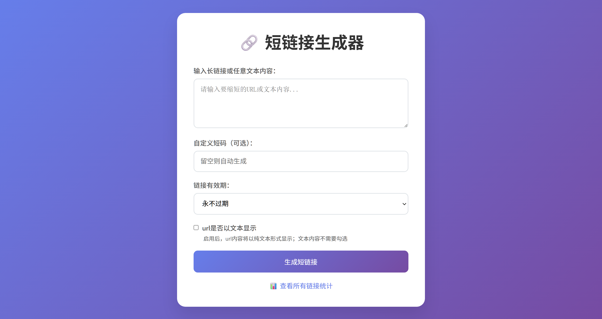
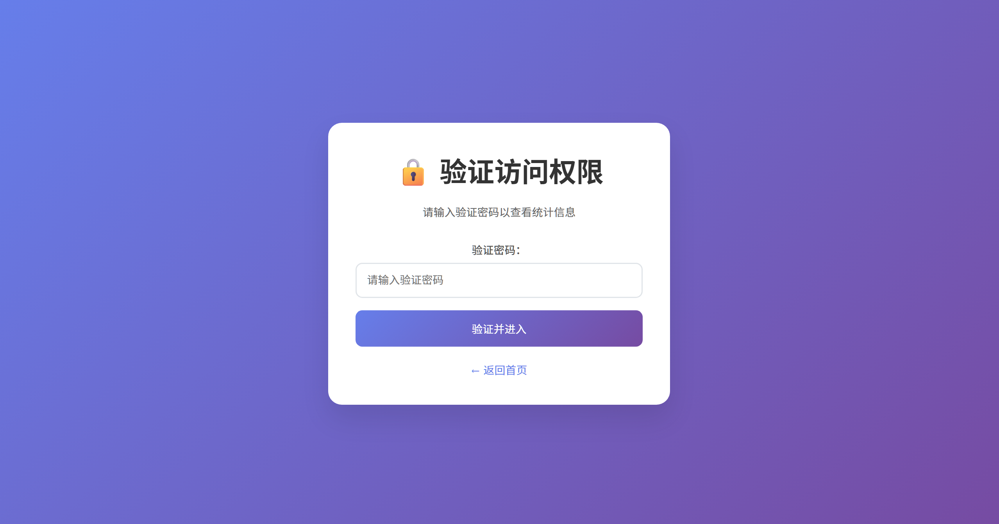
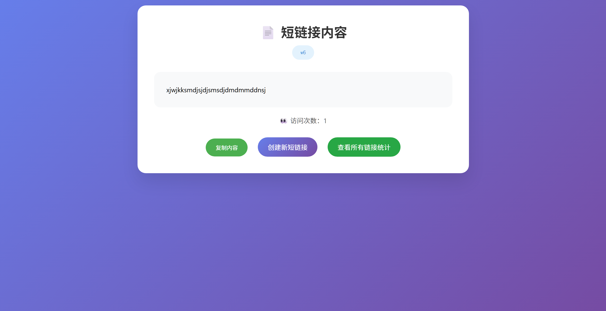

# EdgeOne Pages / cloudflare workers短链接生成器

- 一个短链接生成器，支持 URL 缩短、文本内容存储、访问统计等功能。
- 根据tinystacklab/cloudflare-short-link-generator项目AI修改而来
## 功能特性

- 🔗 **URL 缩短**：将长链接转换为短链接
- 📝 **文本存储**：存储任意文本内容并生成访问链接
- ⏰ **过期时间**：支持设置链接过期时间
- 🔒 **访问控制**：统计页面需要密码验证
- 📊 **访问统计**：记录每个链接的访问次数
- 🎨 **响应式设计**：支持移动端和桌面端访问


## 页面






## 部署步骤
## EdgeOne Pages
### 1. 准备工作

- 注册腾讯云账号
- 开通 EdgeOne 服务
- 创建 EdgeOne Pages 项目

### 2. 配置 KV 存储

1. 登录腾讯云控制台，进入 EdgeOne 服务
2. 在左侧菜单选择 "Pages" -> "KV 存储"
3. 点击 "立即申请" 开通 KV 存储服务（需要审核）
4. 创建KV存储并与项目绑定，KV命名空间管理变量名称必须为 `LINKS_KV` 

### 3. 配置环境变量

在 EdgeOne Pages 项目的 "环境变量" 中添加以下配置：

| 变量名 | 说明 | 默认值 |
|--------|------|--------|
| `DOMAIN` | 自定义主页访问路径 | /u | 
| `PASSWORD` | 自定义密码(HA256编码) | password |

**安全提示：**
- 建议修改默认的验证密码哈希
- 设置 `DOMAIN` 变量可以隐藏主页路径，提高安全性


### 4. 配置自定义域名（可选）

1. 在 EdgeOne Pages 项目详情页，选择 "自定义域名"
2. 添加你的自定义域名
3. 按照提示完成域名解析配置

   
### cloudflare workers
1. 复制worker.js到cloudflare workers
2. 创建KV存储
3. 创建变量名'LINKS_KV'与KV存储绑定
4. 部署访问
5. 配置自定义域名（可选）


## 使用说明

### 生成短链接

1. 访问 `https://你的域名/{DOMAIN}`（默认：`https://你的域名/u`）
2. 在输入框中填写要缩短的 URL 或文本内容
3. 可选：设置自定义短码、过期时间、显示模式
4. 点击 "生成短链接"
5. 复制生成的短链接进行分享

**注意：** 如果配置了 `DOMAIN` 环境变量，请使用配置的路径访问

### 访问统计

1. 访问 `https://你的域名/stats`
2. 输入验证密码（默认密码哈希对应密码：`password`，建议修改）
3. 查看所有链接的统计信息
4. 可以删除不需要的链接


## 安全配置

### 修改验证密码

1. 生成你自己的密码哈希：
   ```javascript
   async function generateHash(password) {
     const encoder = new TextEncoder();
     const data = encoder.encode(password);
     const hashBuffer = await crypto.subtle.digest('SHA-256', data);
     const hashArray = Array.from(new Uint8Array(hashBuffer));
     return hashArray.map(b => b.toString(16).padStart(2, '0')).join('');
   }
   ```
2. 将生成的哈希值替换 `validate.js` 文件中的 `expectedHash` 值

## 注意事项

1. 本项目使用 EdgeOne KV 存储，请注意 KV 存储的使用限制和费用
2. 短链接数据会根据设置的过期时间自动清理
3. 请定期备份重要的短链接数据
4. 生产环境使用时请务必修改验证密码

## 许可证

MIT License
