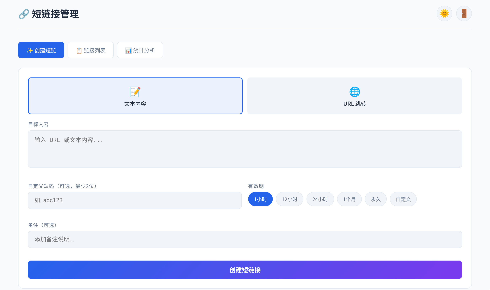
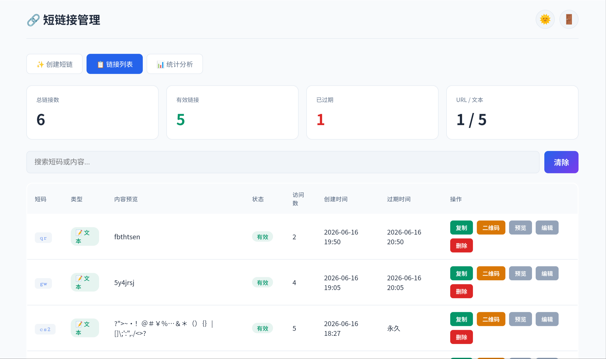
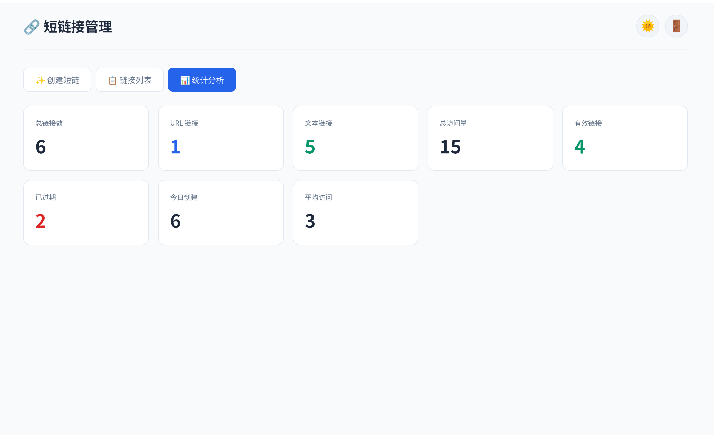

# 🔗 短链接服务

基于 EdgeOne Pages + KV Storage 构建的短链接管理系统，支持 URL 跳转和文本分享，自带管理面板和访问统计。

---

## ✨ 功能特性

- **双模式短链**
  - 📝 **文本分享** — 短码展示文本内容，支持一键复制（默认）
  - 🌐 **URL 跳转** — 短码直接跳转目标网址
- **有效期管理** — 支持 1小时 / 12小时 / 24小时 / 1个月 / 永久 / 自定义时长
- **自定义短码** — 可自定义短码（最少2位，字母数字下划线横线）
- **访问统计** — 实时记录每个短码的访问次数
- **二维码生成** — 创建短链后自动生成二维码，支持下载
- **主题切换** — 支持 🌞 Light / 🌙 Dark 双主题，文本展示页同步适配
- **响应式设计** — 桌面端表格 + 手机端卡片，完美适配各种屏幕
- **安全访问** — 通过 ACCESS_CODE 环境变量控制管理面板访问权限

---

## 页面




## 📁 目录结构

```
├── index.html                    # 管理面板前端页面
└── edge-functions/
    ├── api/
    │   ├── auth.js             # 登录认证 API (/api/auth)
    │   └── links.js            # 短链 CRUD API (/api/links)
    ├── [[default]].js          # 兜底路由：根路径返回 index.html
    └── [code].js               # 短码解析路由 (/:code)
```

---

## 🚀 快速部署

### 1. 创建 EdgeOne Pages 项目

登录 [EdgeOne Makers](https://pages.edgeone.ai) 控制台，创建新项目。

### 2. 上传文件

将本项目的文件按上述目录结构上传到项目根目录。

### 3. 绑定 KV Storage

1. 进入项目 → **KV Storage** → **Bind namespace**
2. 选择或创建一个 KV namespace
3. 设置变量名为 `SHORTURL_KV`

### 4. 设置环境变量

进入项目 → **Settings** → **Environment Variables**，添加：

| 变量名 | 说明 | 示例 |
|--------|------|------|
| `ACCESS_CODE` | 管理面板访问密码（必填） | `your-secret-code` |
| `ACCESS_CODE_SALT` | 可选的盐值，增强 token 安全性 | 任意随机字符串 |

> **关于 SALT**：没有长度限制，建议填 20-30 位随机字符串即可，如 `my-project-salt-2024`。

### 5. 部署

点击 **Deploy**，等待部署完成后即可访问。

---

## 🔧 使用说明

### 管理面板

访问项目域名，输入 `ACCESS_CODE` 即可进入管理面板：

- **✨ 创建短链** — 选择 文本/URL 类型，填写内容，设置有效期，点击创建
- **📋 链接列表** — 查看所有短链，支持搜索、复制、二维码、编辑、删除；点击短码直接跳转
- **📊 统计分析** — 查看总链接数、URL/文本分布、总访问量、有效/过期统计

### 短码访问

- **文本类型**：访问 `https://your-domain.com/短码`，展示文本内容页面，支持复制
- **URL 类型**：直接访问 `https://your-domain.com/短码`，自动 302 跳转

---

## 🎨 主题说明

- 默认使用 **🌞 Light 主题**
- 管理面板和文本展示页均支持主题切换，偏好跨页面同步
- 主题设置保存在浏览器 `localStorage`

---

## ⚠️ 注意事项

1. **KV 一致性**：EdgeOne KV 采用最终一致性，写入后其他节点最多 60 秒延迟
2. **数据量限制**：KV 免费版提供 1GB 存储，单条 value 最大 25MB
3. **短码冲突**：自定义短码若已存在，系统会返回 409 错误
4. **过期清理**：过期链接不会自动从 KV 删除，但访问时会返回 410 状态码
5. **分页支持**：链接列表 API 已添加 KV `list()` 分页循环，支持超过 256 条数据

---

## 📄 API 参考

### POST /api/auth
登录认证，获取访问 token。

```json
{ "code": "your-access-code" }
```

响应：
```json
{ "token": "xxx" }
```

### GET /api/links
获取所有短链列表（需 Authorization: Bearer token）。

### POST /api/links
创建短链。

```json
{
  "type": "text | url",
  "content": "文本内容 或 https://example.com",
  "customCode": "可选自定义短码",
  "expireHours": 0,
  "remark": "可选备注"
}
```

### PUT /api/links
修改短链内容/有效期/备注。

```json
{
  "code": "短码",
  "content": "新内容",
  "expireHours": 24,
  "remark": "备注"
}
```

### DELETE /api/links
删除短链。

```json
{ "code": "短码" }
```

---

## 📝 开源协议

MIT License
